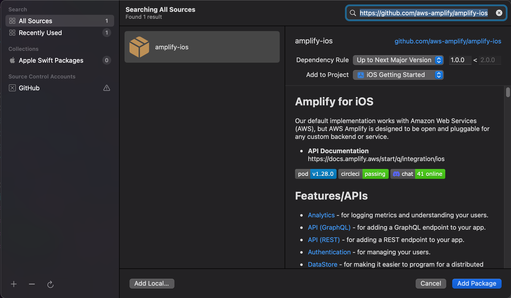
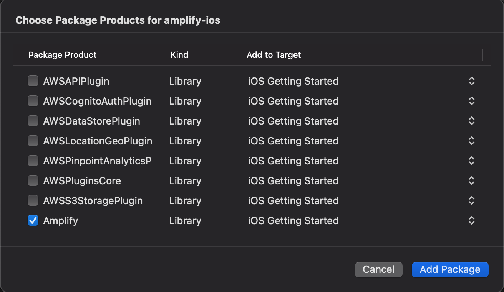

# Introduction

Now that we have created an iOS application, we want to continue development and add new features.

To start to use AWS Amplify in your application, you must install the Amplify command line, initialize the amplify project directory, configure your project to use the Amplify libraries, and initialize Amplify Libraries at runtime.

## What you Will Learn

- Initialize a new Amplify project
- Add Amplify Libraries in your project
- Initialize Amplify libraries at runtime

## Key Concepts

- Amplify CLI - The Amplify CLI allows you to create, manage, and remove AWS services directly from your terminal.

- Amplify libraries – The Amplify libraries allow you to interact with AWS services from a web or mobile application.

# Implementation

## Install Amplify CLI

To install AWS Amplify CLI, open a Terminal, and **type the following command**:

```zsh
## Install Amplify CLI
curl -sL https://aws-amplify.github.io/amplify-cli/install | bash && $SHELL

## Verify installation and version
amplify --version
# 9.1.0
```

## Initialize an Amplify Backend

To create the basic structure of our backend, we first need to initialize the amplify project directory and to create our cloud backend.

Open a Terminal and change directories to your project. For example, if you created your project in the folder `~/Developer`, you can type:

```zsh
cd ~/Developer/iOS\ Getting\ Started
```

Verify you are in the correct directory, it should look like this:

```zsh
➜  iOS Getting Started git:(master) ✗ ls -al
total 32
drwxr-xr-x   9 stormacq  admin   288 Jul  8 15:09 .
drwxr-xr-x  17 stormacq  admin   544 Jul  6 16:20 ..
-rw-r--r--@  1 stormacq  admin  6148 Jul  8 15:06 .DS_Store
drwxr-xr-x   9 stormacq  admin   288 Jul  6 16:12 iOS Getting Started
drwxr-xr-x@  5 stormacq  admin   160 Jul  8 15:09 iOS Getting Started.xcodeproj
```

Initialize the Amplify project structure and configuration file. **Execute the following command**:

```zsh
amplify init

? Enter a name for the project (iOSGettingStarted): accept the default, press enter
The following configuration will be applied:

Project information
| Name: iOSGettingStarted
| Environment: dev
| Default editor: Visual Studio Code
| App type: ios

? Initialize the project with the above configuration? Yes, press enter
Using default provider  awscloudformation, press enter
? Select the authentication method you want to use: AWS profile, press enter
? Please choose the profile you want to use: default, press enter
```

You can create a profile using AWS CLI using `aws configure --profile <name>` if you don't have one yet.

Amplify initilizes your project in the cloud, it might take a few minutes. After a few minutes, you should see a message like:

```zsh
✔ Successfully created initial AWS cloud resources for deployments.
✔ Initialized provider successfully.
Initialized your environment successfully.

Your project has been successfully initialized and connected to the cloud!
```

## Add Amplify Librairies to your Project

1. Switch back to Xcode. Select `File > Add Packages...`


2. Enter the Amplify iOS GitHub repo URL (https://github.com/aws-amplify/amplify-ios) into the search bar and hit **Enter**. Wait for the result to load. You'll see the Amplify iOS repository rules for which version of Amplify you want Swift Package Manager to install. Choose the dependency rule **Up to Next Major Version**, as it will use the latest compatible version of the dependency that can be detected from the main branch, then click **Add Package**.



3. Lastly, choose which of the libraries you want added to your project. For this tutorial, select Amplify, then click **Add Package**.



## Initialize Amplify at Runtime

At runtime, the Amplify libraries require the Amplify configuration files generated by the CLI.

1. Add the Amplify Configuration Files to our Project

    Using the Finder, locate `awsconfiguration.json` and `amplifyconfiguration.json`at the root of your project directory. Drag 'n drop them into your Xcode project:

    

2. Load the Amplify classes at Runtime

    Let's create a `Backend` class to group the code to interact with our backend. I use a [singleton design pattern](https://en.wikipedia.org/wiki/Singleton_pattern) to make it easily available through the application and to ensure the Amplify libraries are initialized only once.

    The class initializer takes care of initializing the Amplify librairies.

    Create a new swift text file `Backend.swift`, add it to your Xcode project (**CTRL-N**) and add this code:

    ```swift
    import UIKit
    import Amplify

    class Backend {
        static let shared = Backend()
        @discardableResult
        static func initialize() -> Backend {
            return .shared
        }
        private init() {
          // initialize amplify
          do {
            try Amplify.configure()
            print("Initialized Amplify");
          } catch {
            print("Could not initialize Amplify: \(error)")
          }
        }
    }
    ```

    We initialize our singleton `Backend` object when application finishes launching.

    Open the `<PROJECT_NAME>App.swift` file and add `Backend.initialize()` in the `init()` method, just like this:

    ```swift
    // inside the <PROJECT_NAME>App.swift file 
    init() {
        // initialize Amplify
        Backend.initialize()
    }
    ```

## Verify your Setup

To verify everything works as expected, build the project. Click **Product** menu and select **Build** or type **&#8984;B**. There should be no error.

[Next](/04_add_authentication.md) : Add user authentication.